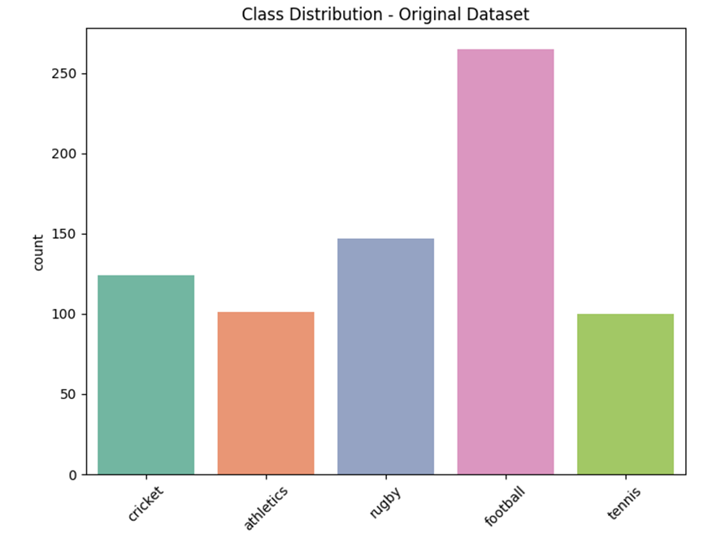
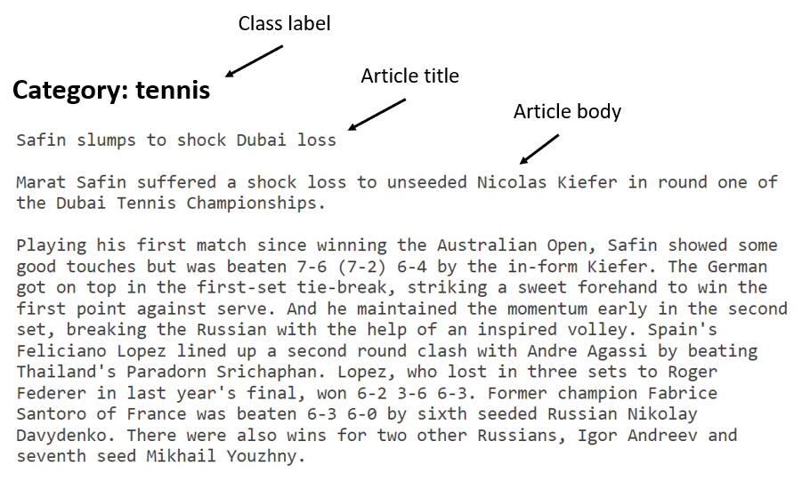
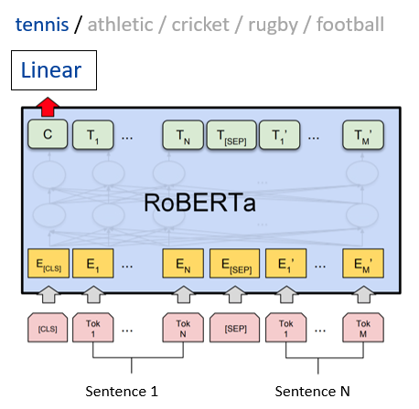

# RoBERTa Sport News Classifier with Synthetic Data Augmentation


[](https://www.python.org/downloads/)
[](https://pytorch.org/)
[](https://huggingface.co/transformers/)
[](https://www.pytorchlightning.ai/)
[](https://streamlit.io/)
[](https://scikit-learn.org/)
[](https://opensource.org/licenses/MIT)


This project explores the use of synthetic data augmentation to improve a RoBERTa-based topic classification model for sports news articles, particularly in scenarios with limited training data. By leveraging GPT-4 to generate high-quality synthetic sports articles, the model's accuracy was significantly improved from 93.5% to 99.5% in classifying news articles into five sports categories: Athletics, Cricket, Football, Rugby, and Tennis.

## Table of Contents
- [Key Features](#key-features)
- [Background](#background)
- [Dataset](#dataset)
- [Methodology](#methodology)
- [Experimental Setup](#experimental-setup)
- [Results](#results)
- [Installation](#installation)
- [Usage](#usage)
- [Web Application](#web-application)
- [License](#license)


## Key Features

- Fine-tuned RoBERTa model for sports news classification
- GPT-4 utilized for synthetic data generation
- Advanced prompt engineering techniques for diverse and novel synthetic data
- Comprehensive experimental setup to evaluate model performance under various data conditions
- Streamlit-based web application for real-time classification demonstrations

## Background

### BERT

- "BERT: Pre-training of Deep Bidirectional Transformers for Language Understanding" (2018, Google)
- Revolutionized NLP with bidirectional training, enabling a deeper understanding of context in pre-trained LMs
- Introduced a new pre-training approach using Masked Language Model (MLM) and Next Sentence Prediction (NSP)
- Strong performance on multiple NLP tasks and paved the way for more advanced transformer-based models

### RoBERTa

- RoBERTa (Robustly Optimized BERT Pretraining Approach), developed by Facebook AI, enhances the BERT model architecture and training process
- Key enhancements include longer training with more data, larger mini-batches, removal of Next Sentence Prediction (NSP), and longer sequence lengths for improved context capture
- Demonstrated improved performance over BERT, achieving state-of-the-art results on major NLP benchmarks

## Dataset

The project utilizes two datasets:

1. **BBCSport Dataset**:
   - Source: [BBC Sports website (2004-2005)](http://mlg.ucd.ie/datasets/bbc.html)
   - Total Documents: 737
   - Topics: Athletics, Cricket, Football, Rugby, Tennis





2. **Synthetic Data**:
   - Generated with GPT-4
   - Total Articles: 136 (27% of the training data)
   -  Included in the project as `data/synthetic_data.csv`

### Sample Article



## Methodology

### Data Generation with GPT-4

- Synthetic data refers to artificially generated data that mimics real-world data characteristics
- It can be used to improve model generalization, especially in data scarcity or class imbalance scenarios
- Recent LLMs like GPT and Claude, trained in an auto-regressive manner unlike the bidirectional training of BERT, excel in generating coherent and contextually relevant text
- Utilized GPT-4 to generate realistic sports news articles to feed to the BERT-based model
- Crafted careful prompts to guide GPT-4 in producing diverse sports news articles balanced across the 5 categories
- Adopted a zero-shot approach to ensure higher diversity in synthetic data and avoid repetition
- Guided the model to produce articles that follow the structure and style of the articles in the BBCSport dataset

#### Iterative Generation Process

1. **First Prompt (Generating the first articles):**

```
Create N high-quality sports news articles, each corresponding to one of these categories: athletics, cricket, football, rugby, and tennis. For each category, generate articles with these guidelines:

Length and Detail: Each article should be 2-3 paragraphs long, providing a rich, detailed account relevant to the sports category.

Uniqueness and Variety: Avoid duplicating content from previous iterations. Each article should offer fresh perspectives, covering diverse topics, events, players, and outcomes.

Balanced Representation: Distribute the articles evenly across the five categories, ensuring a balanced portrayal of each sport.

Writing Style: Vary the writing style across articles, from in-depth match reports to concise event summaries, to mimic the diversity of sports journalism.

Plausibility and Coherence: Maintain realism and factual possibility, ensuring each article is logical and coherent within its sports context.

Class Label: Include the sport category at the end of each article.

These articles are for a data set to train a machine learning model, so creativity and variety are key.

I will keep asking you to generate N articles more. So, In subsequent iterations, please generate completely new content, ensuring no overlap with any articles generated in previous requests.
```

2. **Second Prompt (Data Download):**
   Requested the export of generated articles into a CSV file with 'Article' and 'Class' columns.

3. **Third Prompt (Generating more articles):**
   Similar to the first prompt, but emphasizing the generation of unique content that is different from previous iterations.

This process was repeated until a total of 136 synthetic articles were generated.

### Model Architecture



The project uses a RoBERTa model fine-tuned for the specific task of sports news classification:

1. **Base Model**: RoBERTa-base
2. **Fine-tuning**: The model was fine-tuned on the BBCSport dataset and augmented with synthetic data
3. **Classification Head**: A linear layer was added on top of the RoBERTa model for the 5-class classification task

## Experimental Setup

The experiments were conducted with five different configurations to evaluate the impact of synthetic data:

1. **Baseline (60% of Original Data, No Synthetic)**:
   - Train: 60% of original BBC data
   - Validation: 20% of original BBC data
   - Test: 20% of original BBC data
   - Purpose: To establish a baseline performance using a majority of the original dataset for training, without synthetic augmentation.

2. **Reduced Training Data (50% of Original, No Synthetic)**:
   - Train: 50% of original BBC data
   - Validation: 25% of original BBC data
   - Test: 25% of original BBC data
   - Purpose: To assess performance with a significantly reduced training dataset, without synthetic data.

3. **Synthetic Augmentation (50% of Original + Synthetic)**:
   - Train: 50% of original BBC data + All synthetic data (136 samples)
   - Validation: 25% of original BBC data
   - Test: 25% of original BBC data
   - Purpose: To evaluate the impact of augmenting training data with synthetic samples on model performance.

4. **Synthetic Test Set (50% of Original Data for Training)**:
   - Train: 50% of original BBC data
   - Validation: 25% of original BBC data
   - Test: All synthetic data (136 samples)
   - Purpose: To test the model's generalization on an entirely synthetic test set.

5. **Combined Original and Synthetic Dataset**:
   - Train: 50% of the combined dataset
   - Validation: 25% of the combined dataset
   - Test: 25% of the combined dataset
   - Purpose: Evaluate the model's performance when the whole dataset is augmented with synthetic data.

## Results

The experiments demonstrated significant improvements in model performance, especially in data-scarce situations:

| Configurations                                           | Acc (%)   | F1        | Precision | Recall    | Test Loss | Val Loss |
| -------------------------------------------------------- | --------- | --------- | --------- | --------- | --------- | -------- |
| Baseline (60% of Original Data, No Synthetic)            | 97.3      | 97.29     | 97.49     | 97.3      | 0.42      | 0.39     |
| Reduced Training Data (50% of Original, No Synthetic)    | 93.51     | 93.51     | 94.19     | 93.51     | 0.75      | 0.66     |
| **Synthetic Augmentation (50% of Original + Synthetic)** | **99.46** | **99.46** | **99.47** | **99.46** | **0.25**  | **0.23** |
| Synthetic Test Set (50% of Original data for Training)   | 99.26     | 99.27     | 99.29     | 99.26     | 0.441     | 0.39     |
| Combined Dataset (50% of Combined dataset for Training)  | 97.72     | 97.69     | 97.91     | 97.72     | 0.48      | 0.49     |

## Installation

```bash
git clone https://github.com/daehan-lim/roberta-sport-news-classifier.git
cd roberta-sport-news-classifier
pip install -r requirements.txt
```

After cloning, download the BBCSport dataset from the [official source](http://mlg.ucd.ie/files/datasets/bbcsport-fulltext.zip), extract it and place the `bbcsport` folder in the `data/` directory.

## Usage

### Training the Model

To train the model, use the `main.py` script:

```bash
python main.py [arguments]
```

Available arguments:

- `--configuration`: Specifies the experimental configuration (BASELINE, REDUCED_TRAINING_DATA, SYNTHETIC_AUGMENTATION, SYNTHETIC_TEST, COMBINED_DATASET)
- `--lr`: Learning rate (default: 1e-05)
- `--drop`: Dropout rate (default: 0.3)
- `--max_token_len`: Maximum token length (default: 256)
- `--hidden_dim`: Hidden dimension size (default: '768')
- `--batch_size`: Batch size (default: 64)
- `--epochs`: Number of training epochs (default: 4)
- `--devices`: Number of GPU devices to use (default: 8)
- `--num_workers`: Number of worker processes for data loading (default: 8)
- `--single_gpu`: Whether to use a single GPU (default: True)
- `--synthetic`: Whether to use synthetic data (default: True)
- `--train_size`: Proportion of data to use for training (default: 0.5)

Example:
```bash
python main.py --configuration SYNTHETIC_AUGMENTATION
```

After training, the model will save checkpoints and results as follows:

- **Model Checkpoints**: Saved in the `saved/` directory. 
- **Results**: A CSV file named `Results.csv` is created or updated with the latest results in the root directory. This file contains the performance metrics (Accuracy, F1 Score, Precision, Recall, Test Loss, and Validation Loss) for each configuration.

### Using run_main.py

For convenience, use the `run_main.py` script to run experiments with predefined configurations:

```bash
python run_main.py
```

This script sets up specific parameters and runs `main.py` with these configurations. It also saves the output to a timestamped log file in the `logs/` directory.

To modify the configuration, edit the variables at the top of `run_main.py`.

### Testing the Model

To test the model or make predictions, use the `test.py` script:

```bash
python test.py --model_identifier <MODEL_ID> --article "<ARTICLE_TEXT>" [--only_predict <BOOL>]
```

**Arguments**:
- `--model_identifier`: Specifies the filename of the saved PyTorch Lightning model checkpoint. This should match the configuration used during training and correspond to a .ckpt file in the `saved_models/` directory. 
- `--article`: The text of the sports article to classify. Enclose in quotes.
- `--only_predict`: If set to True, only makes a prediction for the given article without performing an evaluation on the test set. Default is True.

**Examples**:
```bash
# Make a prediction on a single article
python test.py --model_identifier SYNTHETIC_AUGMENTATION --article "In a thrilling match at Wimbledon, Novak Djokovic secured his 20th Grand Slam title with a hard-fought victory over Matteo Berrettini."

# Run full test metrics on the test set
python test.py --model_identifier BASELINE --only_predict False
```
## Web Application

A Streamlit-based web application has been deployed for real-time classification demonstrations. To run the app locally:

```bash
streamlit run app.py
```

The web application allows users to:
- Select different model configurations
- Input custom spoarts articles for classification
- View detailed performance metrics and visualizations

## License
This project is licensed under the MIT License - see the [LICENSE](LICENSE) file for details.